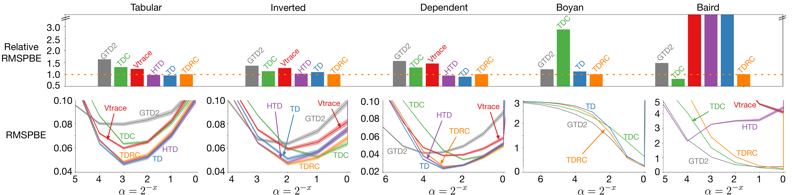
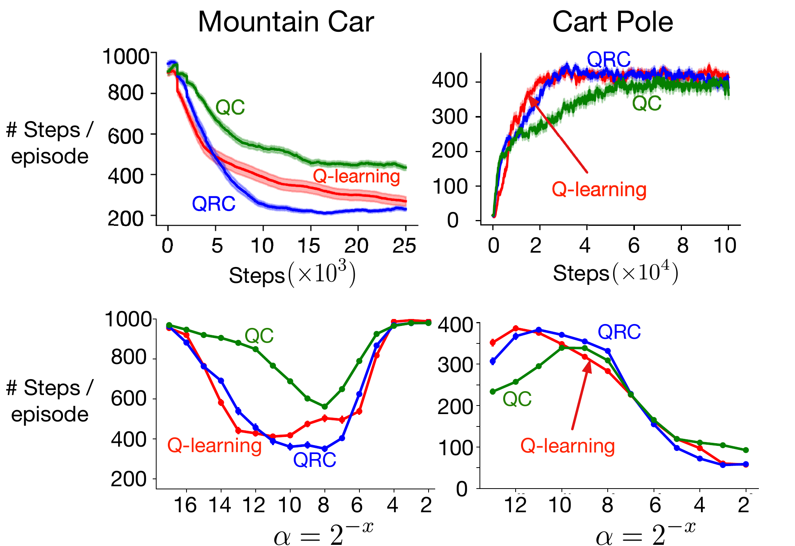

# Gradient Temporal-Difference Learning with Regularized Corrections

### [Paper](https://arxiv.org/abs/2007.00611) | [Documentation](#library-documentation) | [Experiments](#experiments)

- Sina Ghiassian* [[github](https://github.com/sinaghiassian) | [website](https://sinaghiassian.github.io/)]
- Andrew Patterson* [[github](https://github.com/andnp) | [website](https://andnp.github.io) | [scholar](https://scholar.google.ca/citations?user=jd2nCqYAAAAJ)]
- Shivam Garg [[github](https://github.com/svmgrg) | [website](https://svmgrg.github.io/)]
- Dhawal Gupta [[github](https://github.com/dhawgupta) | [website](https://dhawgupta.github.io/) | [scholar](https://scholar.google.ca/citations?user=n1Lsp_8AAAAJ)]
- Adam White [[github](https://github.com/amw8) | [website](https://sites.ualberta.ca/~amw8/) | [scholar](https://scholar.google.ca/citations?user=1GqGhcsAAAAJ)]
- Martha White [[github](https://github.com/marthawhite) | [website](https://webdocs.cs.ualberta.ca/~whitem/) | [scholar](https://scholar.google.ca/citations?user=t5zdD_IAAAAJ)]

# This Repo
This repository serves three purposes:
**(1)** to provide code for running our proposed algorithms as benchmarks,
**(2)** to provide a heavily cleaned-up version of the code we used in the experiments for reproducibility, and
**(3)** to provide an easily readable and concrete demonstration of our empirical methodology through code.
In the `TDRC/` folder, you will find fairly abstract implementations of each of the proposed algorithms, intended to be imported and extended for benchmarking.
Examples of how to use this library functionality can be found in the `examples/` directory.
The `experiments/` directory contains the code for reproducing the most important figures in the paper, which can be easily extended to reproduce any of the figures in the paper.

Because research codebases tend to contain significant amounts of "legacy" code and experiments that ultimately do not make into the published paper, we chose to transcribe fresh and clean code for this repository.
While we extensively tested this code before publishing to github, it is always possible that we introduced bugs during this transcription process.
If this is the case, feel free to create a [github issue](https://github.com/rlai-lab/Regularized-GradientTD/issues/new) and tag [andnp](https://github.com/andnp) in the issue to get my attention.

# Library Documentation
This repo can be installed as a python library using
```bash
pip install git+https://github.com/rlai-lab/regularized-gradienttd.git
```
We provide implementations of the three learning algorithms introduced in our paper:
 * [TDRC](TDRC/TDRC.py) - for non-linear state-value function approximation
 * [DQRC](TDRC/DQRC.py) - for non-linear control using action-value function approximation
 * [DQC](TDRC/DQC.py) - a special case of the DQRC agent where `\beta = 0`.

Each learning algorithm is implemented using [torch](https://pytorch.org/) and can take an arbitrary neural network as argument.
The API for each learning algorithm is consistent, except for TDRC which does not require knowledge of the number of actions.
This implementation is intended to be minimal and so does not provide the ability to generate the form of the network, manage the experience replay buffer, nor maintain the target network.
The responsibility to maintain each of these is the user's.
It is suggested that users treat each of these implementations as a base class, extending the class to match the implementations of other algorithms used in your experiments.

```python
from TDRC.DQRC import DQRC

# An example neural network module
class Network(nn.Module):
    def __init__(self):
        super().__init__()
        # generates the "features"
        self.model = nn.Sequential(
            nn.Linear(2, 32),
            nn.ReLU(),
            nn.Linear(32, 32),
            nn.ReLU(),
        )

        # estimates Q(S, A) from the features generated by self.model
        self.output = nn.Linear(32, 3)

    def forward(self, x):
        features = self.model(x)
        outputs = self.output(features)
        return outputs, features

agent = DQRC(
    features=32, # number of "features" generated by the second-to-last layer of the neural network
    actions=3, # number of unique actions
    policy_net=Network(), # this should be a torch `nn.Module` whose forward function returns the outputs and the features
    target_net=Network(), # this can be a copy of the policy network
    optimizer=torch.optim.Adam(...),
    params={
        'alpha': 0.01, # the stepsize for the secondary set of weights
        'beta': 1.0, # the regularization parameter
        'epsilon': 0.1, # this implementation provides e-greedy action selection, extend the class to override
    },
    device=torch.device('cpu'), # provide a device (or None)
)

# get the e-greedy action given the current state
# `state` should be a torch.tensor
action = agent.selectAction(state)

# update towards a mini-batch of samples
# each sample should be a tuple:
# (state, action, reward, next_state, gamma)
# where each is of type torch.tensor
agent.updateNetwork(samples)
```

For a more in-depth and complete example, take a look at [examples/MountainCar.py](examples/MountainCar.py) which combines the DQRC agent with OpenAI-Gym's Mountain Car environment.
This example can be run from the root directory of the repository using
```bash
python3 examples/MountainCar.py
```

# Experiments
We include code for reproducing some of the figures in the paper in the `experiments/` directory of this repo.
The framework that we include for the experiment code should allow one to easily reproduce all of the figures in the paper, beyond those for which we provide explicit scripts.
In the near future we intend to include the code to reproduce the experiments on the [MinAtar](https://github.com/kenjyoung/MinAtar) environment.


## Linear Prediction

This experiment shows the effectiveness of TDRC across a variety of small linear prediction problems; suggesting that TDRC's performance is generally not problem dependent, unlike each of the competitor benchmark algorithms to which we compare.
TDC, a special case of TDRC, seems to perform well across all problems except for Boyan's chain. TD and HTD both perform well across many domains except for the popular Baird's Counterexample domain.

Running the script `experiments/prediction/figure1.py` will produce the bar plot at the top of this figure (though without the nice formatting).
This figure was produced using 200 independent random seeds and with stepsizes selected according to the lowest area under the RMSPBE error curve.
We do not include the code to perform the parameter sweep---though this is trivial to implement from the provided code---however we hard-code the stepsizes found from the parameter study into the script for the bar plot.
```bash
cd experiments/prediction
pip install -r requirements.txt
python3 figure1.py
```

## Nonlinear Control


This experiment compares the nonlinear control variants of TD, TDC, and TDRC (Q-learning, QC, and QRC respectively) on the Mountain Car and Cart Pole environments using neural network based function approximation.
We used experience replay with mini-batches of 32 samples and with **did not** use target networks in our implementation for these domains.
The results pictured above are averaged over 200 independent random runs.

Running the script `experiments/control/figure5.py` will produce the learning curve for the Mountain Car domain.
We did not include an implementation of the Cart Pole domain, however extending the script `examples/MountainCar.py` one can easily additionally run experiments on Cart Pole (or any other Gym environment).
Because the meta-parameter study for nonlinear control is so expensive, we hard-code the best stepsizes found from our own study in the learning script.
```bash
cd experiments/control
pip install -r requirements.txt
python3 figure5.py
```

# Citation

If you find our work useful in your research, please cite:
```
@inproceedings{ghiassian2020gradient,
    author = {Ghiassian, Sina
              and Patterson, Andrew
              and Garg, Shivam
              and Gupta, Dhawal
              and White, Adam
              and White, Martha},
    title = {Gradient Temporal Difference Learning with Regularized Corrections},
    booktitle = {Proceedings of the 37th International Conference on International Conference on Machine Learning},
    year={2020}
}
```
